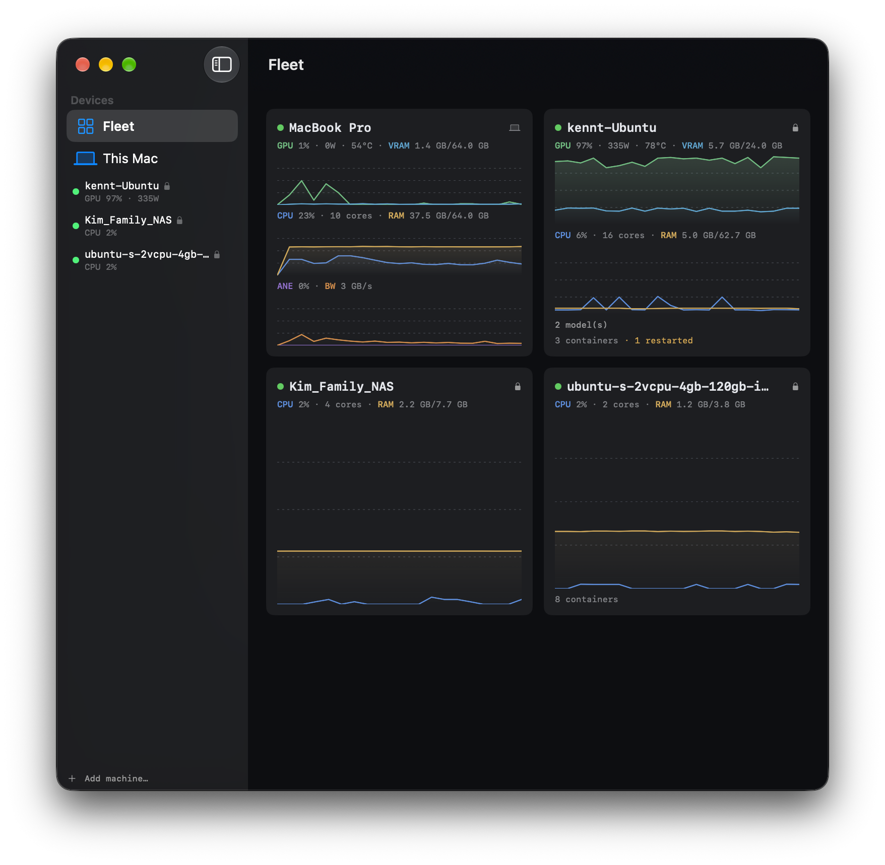
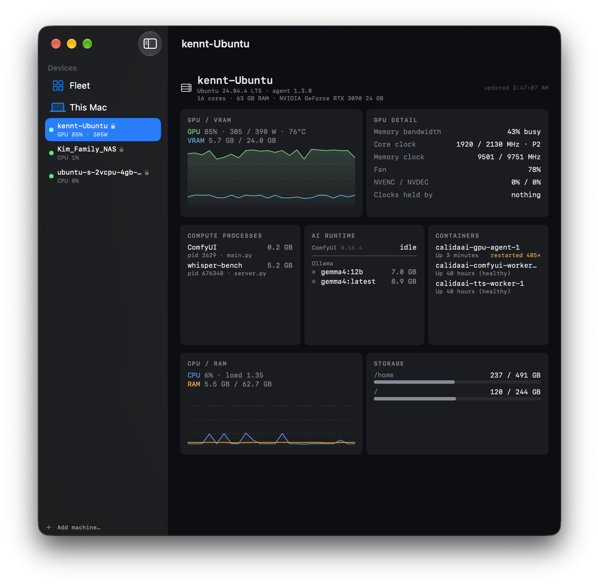
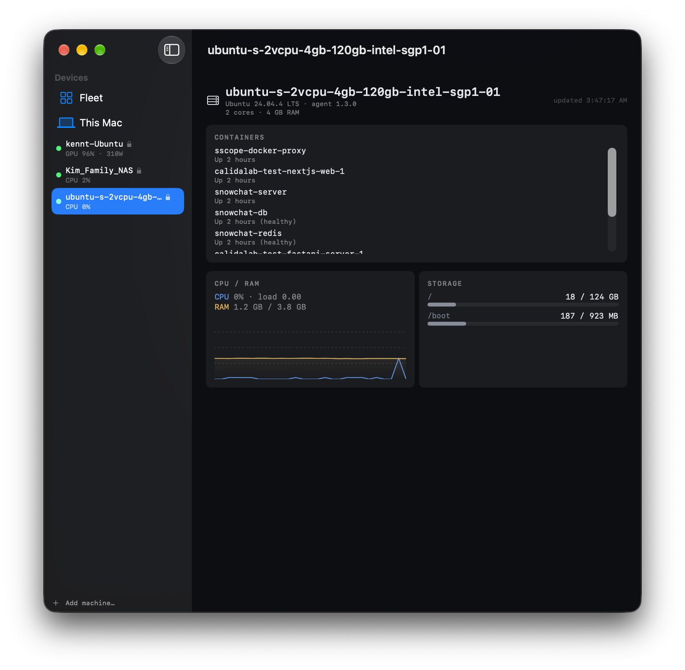

# SiliconScope

[English](README.md) · [Deutsch](README.de.md) · [简体中文](README.zh-CN.md) · [繁體中文](README.zh-TW.md) · **日本語** · [한국어](README.ko.md)

[](https://siliconscope.calidalab.ai)
[](https://github.com/kennss/SiliconScope/releases/latest)
[](https://github.com/kennss/SiliconScope/releases)
[](LICENSE)


[](https://trendshift.io/repositories/57307)

**sudo なしで動く Apple Silicon 用のシステムモニター**です。ネイティブ SwiftUI のダッシュボード**と**、メニューバー項目一式を備えています。Activity Monitor やターミナル系のモニターでは見えない **ANE（Neural Engine）**・**Media Engine**・**メモリ帯域幅**も、CPU や GPU と同じ扱いで常に表示します。

もともとは、オンデバイス AI やメディア処理が Apple Silicon のアクセラレータをどう使っているのかを*実際に見る*ために作りました。いまでは iStat Menus の代わりとして毎日使えるモニターになっています。

**4.0 からは*ほかの*マシンも監視できます。** ヘッドレスの Mac mini、机の下の Linux GPU マシン、借りているクラウドインスタンスなどで小さなエージェントを動かすと、ペアリング済みの暗号化接続を通じて同じダッシュボードに表示されます。リモートの Mac も **Neural Engine を含めて**、ローカルとまったく同じように表示されます。

*[AAPL Ch.](https://applech2.com/archives/20260620-siliconscope-apple-silicon-mac-system-monitor.html)（日本語）、[OWC Rocket Yard](https://eshop.macsales.com/blog/99094-siliconscope-improves-upon-macos-activity-monitor-with-apple-silicon-insights/)（英語）、[ifun.de](https://www.ifun.de/siliconscope-ueberwacht-apple-ki-neural-engine-und-speicher-in-echtzeit-282222/)（ドイツ語）で紹介されました。*


*macOS 27 の M1 Max 1 台に、実際のオンデバイス AI の負荷をかけたところです。[Spectalo](https://spectalo.calidalab.ai/) が Core ML モデルを実行しています。ワークロード分類器の判定は **ANE (CoreML)** で、Neural Engine は **100 % アクティブ、16 GB/s** です。この値はクラスタ residency の実測値なので、このチップのエネルギーカウンタが約 30 分に一度しか更新されない macOS 27 でもリアルタイムに動きます。GPU は 100 %・36 W、メモリ帯域はチップの上限 400 GB/s に対して 306 GB/s で（**帯域律速**）、ヘッダーの **system 105 W** は Mac 全体の消費電力です。色を付けるのは注意が必要な箇所だけで、ここでは 90 °C を超えた CPU と GPU の温度が赤になっています。それ以外はニュートラルな色のままです。下部のバーは 3.0 で追加した **Replay** です。すべての指標が記録されるので、レコーダーのようにセッションを巻き戻して見返せます。*

### メニューバー — iStat のように全指標を表示

どのカードも、独立したメニューバー項目としてピン留めできます（**CPU · GPU · メモリ · ネットワーク · SSD · センサー · バッテリー**）。各項目には、値に合わせて動くグリフと情報量の多いドロップダウンが付きます。**表示形式**（バー · ヒストリーグラフ · 2 行 · 単一値 · アイコン）と表示する値は項目ごとに選べるので、同じ指標を 2 つ並べることもできます。たとえば CPU をバーとグラフの両方で表示するといった使い方です。どれも sudo は要りません。


<p align="center">
  
  
  
</p>

*特に情報量の多いドロップダウンです。**GPU / Media / Neural** は、GPU・GPU メモリ・ANE・Media をライブメーターと 4 本線の 60 秒トレンドで表示します。**センサー**はユニット別の温度で、実在する **E-Core / P-Core / GPU / Memory** センサーの値を読みます（M1–M5 はチップ世代ごとに選んだ SMC キー、それ以外は HID で取得）。**SS コックピット**はマシン全体を 1 つのドロップダウンにまとめたもので、ワークロードの判定、すべてのエンジン、60 秒トレンド、上位プロセスが並びます。*


*必要なときに実行するベンチマークです。「Measure tok/s」で短い生成を 1 回実行し、モデルのデコード速度とエネルギー効率（**tokens/sec · tokens/Wh**）を測ってモデルごとに保存します。*

> 📊 **お使いの Mac で tok/s を測ったら**、[Discussions に投稿してください](https://github.com/kennss/SiliconScope/discussions/5)。みんなで集めたチップ別の表は、ほかの人がハードウェアを選ぶときの参考になります。

## 4.0 で追加された機能

### 🛰 Fleet — ほかのマシンも同じダッシュボードで

リモートのマシンでエージェントを動かすと、**Devices** サイドバーに **This Mac** と並んで表示されます。同じ LAN 内のマシンは mDNS で自動的に見つかるので、IP アドレスを設定する必要はありません。



*4 台のマシンをひと目で確認できます。この Mac、**97 %**・**335 W** で動いている RTX 3090 搭載マシン、Synology NAS、クラウドの Droplet です。各タイルは **GPU + VRAM** と **CPU + RAM** を 1 つの軸に重ねて描き、Apple Silicon ではさらに **ANE + メモリ帯域**が加わります。指標名はそれぞれの線と同じ色で書かれているので、凡例はありません。タイルの最下段には、そのマシンで動いているものが出ます。GPU マシンは**モデル 2 つ**と**コンテナ 3 つ、うち 1 つが再起動**（オレンジ）、Droplet は**コンテナ 8 つ**です。この Mac は常に最初のタイルです。*

- **リモートの Mac も、ローカルとまったく同じダッシュボードで表示します。** E/P コア、GPU、**ANE**、Media、メモリ帯域幅、電力、ファンまで見られます。**リモート Mac の Neural Engine** を表示できるツールは、知る限りほかにありません。
- **Linux/NVIDIA マシンは GPU 中心の表示になります。** 使用率、VRAM、カードの上限に対する電力、温度に加えて、Apple Silicon と同じ問いに答えます。**帯域で頭打ちになっていないか**、クロックが上限にどこまで近いか、**何がクロックを抑えているか**（電力上限、熱による減速）。その上で動いているものも表示します。VRAM を確保しているプロセス（スクリプト名とコンテナ名で）、**Ollama** モデル、**ComfyUI** のキュー、再起動回数付きの**コンテナ**です。3090 に E コアがあるかのような表示はしません。
- **GPU のないサーバー**（Docker でサービスを動かしているクラウドの Droplet など）は、コンテナ、CPU、メモリ、ディスクを表示します。エージェントに root 権限を渡さずに読み取れます。


*別の Mac から見たヘッドレスの M1 Air です。**4E+4P** コア、GPU/Media/**ANE の推定値**、実際のメモリ内訳（**wired 1.0 / active 2.7 / compressed 0.5 GB**、プレッシャー 19%）が表示されています。センサー欄にはファンの値をでっち上げず、そのまま **fanless** と出ます。エージェントがネットワーク越しに埋められないカードは、偽の値を入れずに省きます。*



*同じアプリで、種類の違うマシンを表示したところです。RTX 3090 が **305 / 390 W** で動いていて、なぜその速さなのかも見えます。メモリ帯域は **43 % 使用**、コアクロックは **2130 MHz のうち 1920 MHz**（P2）、クロックを抑えている要因はありません。VRAM を確保しているプロセスはスクリプト名で表示されます。`whisper-bench` が **5.2 GB**、ComfyUI が **0.2 GB** です。隣には ComfyUI のキュー、ディスク上の Ollama モデル、コンテナが並び、「Up 3 minutes」と表示されているコンテナは実は **485 回再起動**しています。E コアも ANE もありません。このマシンにはもともとないからです。*



*Tailscale 経由で接続した 2 vCPU のクラウド Droplet です。GPU がないので、画面はこのサーバーで動いているものから始まります。コンテナ 8 つは読み取り専用の Docker プロキシ経由で読んでいるので、エージェントが root 権限を持つことはありません。その下が CPU、メモリ、ディスクです。設定方法は [Fleet マニュアル](docs/fleet.md#a-cloud-server-vps)（英語）にあります。*

接続はすべて **TLS で暗号化し、トークンで認証**します。ビューアは初回接続時にエージェントの証明書をピン留めする（TOFU）ので、鍵が変わったエージェントやなりすましのエージェントは、知らないうちに信頼されることはなく拒否されます。


*Mac 1 台で使う場合は何も変わりません。同じダッシュボードに、折りたためる **Devices** サイドバーが 1 つ増えただけで、畳んでおけば 3.x とまったく同じです。*

#### エージェントのインストール

Linux でも macOS でも同じコマンド 1 行です。

```sh
curl -fsSL https://raw.githubusercontent.com/kennss/SiliconScope/main/scripts/install-agent.sh | sh
```

最後に `sscope://pair…` のリンクが 1 行表示されます。アプリの **Add machine…** に貼り付ければ、マシンの追加とペアリングが一度に済みます。自分が使っている Mac ならエージェントは不要です。**Settings → Share this Mac to Fleet** をオンにしてください。

**📖 [Fleet マニュアル](docs/fleet.md)**（英語）— ヘッドレスの Mac、Linux GPU マシン、root 権限を渡さずに Tailscale でつなぐクラウドサーバー、Intel Mac、Windows、トークンの変更、エージェントの削除、つながらないときの確認点。

## 3.0 で追加された機能

### 🧠 プロセスインスペクタ — sudo なしでプロセスごとの指標を表示

プロセスをクリックするとインスペクタが開き、Activity Monitor では見えない情報を表示します。**CPU（P/E 別）· IPC · プロセスごとの電力（W）· メモリ · ディスク**には、それぞれライブのスパークラインが付きます。さらに、ほかのツールではプロセス単位で見られない **Neural Engine メモリ**も表示するので、どのアプリが ANE を使っていて、どれだけ確保しているかがすぐにわかります。


*オンデバイスの文字起こしアプリが動いているところです（右）。CPU 65%、**IPC 2.43**、**0.64 W**、そして **762 MB の Neural Engine メモリ**。この ANE の使用量をプロセス単位で表示するモニターは、ほかにありません。macOS がシステム全体の値しか出さないアクセラレータ（GPU / ANE 電力 / Media / 帯域幅）については、その旨を明記し、プロセスごとの数値を作り出すことはしません。*

### ⏺ 記録と再生 — Mac の指標を録画して見返す

**Record** を押すと、CPU・GPU・ANE・Media・帯域幅・電力・センサー・プロセスのすべての指標を、コンパクトな `.ssrec` ファイルに記録し続けます。あとからダッシュボード全体を**再生 / 一時停止 / スクラブ / 速度変更**しながら見返せるので、気づいたときにはもう消えていたスパイクも確認できます。データはすべて Mac の中にとどまります。記録は書き出して共有したり、あとで比較したりできます。


*Replay バーでは、再生 / 一時停止 / コマ送り、タイムラインのスクラブ、速度の変更、記録の保存（Save）ができます。*

## 開発の経緯

SiliconScope は、オンデバイス AI 動画プレーヤー **[Spectalo](https://spectalo.calidalab.ai/ja/)** の開発中に生まれました。Spectalo が実際にチップをどう使っているかを見るためにモニターを 2 つ同時に開いていたのですが、どちらにも不満がありました。

- **asitop / NeoAsitop** はチップレベルの数値が出るものの、TUI が見づらく情報量も少ない。
- **btop** はきれいで情報密度も高いのに、肝心の **ANE（Neural Engine）・Media Engine・メモリ帯域幅**が見られない。

2 つを並べて開いておくのは面倒で、画面も無駄になります。最初は NeoAsitop と btop を fork して足りない部分を補おうとしましたが、途中でやめて、きちんと一から作ることにしました。Apple Silicon 固有の情報を表示でき、ターミナルに慣れた人でなくても読める、**ネイティブで見やすい 1 つの GUI** です。

そうして作ったのが SiliconScope です。

完成してみると、長年毎日使ってきた **iStat Menus** から、ようやく乗り換えられると気づきました。そのためのリリースが **2.0** です。メニューバー項目一式、ユニット別のセンサー、バッテリーの健全性など、iStat の代わりを務めるのに必要なものをそろえました。

## インストール

いちばん簡単なのは **Homebrew** です。

```sh
brew install --cask siliconscope
```

DMG を使う場合は、**[⬇ 最新 DMG をダウンロード](https://github.com/kennss/SiliconScope/releases/latest)** して次の手順でインストールします。

1. ダウンロードした `SiliconScope-*.dmg` を開く
2. **SiliconScope** を **アプリケーション** にドラッグ
3. 起動する

Developer ID で署名し、**Apple の公証**も受けているので、Gatekeeper の警告は出ません。動作環境は **macOS 14+ · Apple Silicon** です。以降は Sparkle で**自動アップデート**されるので、DMG を手動でダウンロードするのは最初の 1 回だけです。

> **リリース前の macOS（ベータ版）はサポートしていません。** このプロジェクトで使える Mac は正式版の入った 1 台だけなので、開発者ベータで起きる問題をこちらで再現・検証できません。それでも報告は歓迎しますし、実際に役立ってきました。SiliconScope は、Apple がビルドごとに名前を変える非公開の IOReport インターフェースを読んでいます。名前の変更を早く知ることができれば、一般に配布される前に修正できます。ただし、修正はベータのシードではなく正式リリースに合わせて公開します。

自分でビルドする場合は、英語版 README の [Build & run](README.md#build--run) を参照してください。

計測部分は `SiliconScopeCore` という Swift ライブラリなので、自分のツールに組み込んで使えます。[ライブラリとして使う](docs/library.md)（英語）を参照してください。安定した API ではありません。

## 主な機能

- **プロセスインスペクタ** *(3.0 で追加)*：1 つのプロセスについて、CPU（P/E 別）、IPC、プロセスごとの**電力（W）**、メモリ、ディスク、**Neural Engine メモリ**を表示。どれも sudo は不要
- **記録と再生** *(3.0 で追加)*：すべての指標を `.ssrec` ファイルに記録し、ダッシュボードを録画のように**再生 / 一時停止 / スクラブ / 速度変更**しながら見返せる
- **AI Workload ビュー**：ボトルネック分類器（*bandwidth-bound* / *compute-bound* / *thermal-throttled* / *memory-pressured*）が、チップごとのメモリ帯域の仕様上限と照らし合わせて、「いまローカル LLM の足を引っ張っているのは何か」を判定
- **E コアと P コアを区別**：クラスタごとの使用率と、実際の DVFS 周波数
- **GPU**：使用率・電力・周波数
- **ANE と Media Engine**：Neural Engine の稼働状況（クラスタ residency の実測値）・電力・メモリトラフィックと、メディアコーデックの帯域（ほかのツールにない点）
- **メモリ帯域幅**：CPU / GPU / Media / ANE / 合計の GB/s（ローカル LLM のボトルネックを見分ける目安）
- **メモリ**：Wired / Active / Compressed / Free の積み上げバーと、macOS の**メモリプレッシャー**警告
- **ネットワーク**の送受信（↑/↓）と、**ディスク**の読み書き・空き容量をライブグラフで表示
- **ユニット別の温度**：世代ごとに選んだ SMC キーで、実在する **E-Core / P-Core / GPU / Memory** センサーを読む（M1–M5、それ以外は HID で取得）。ファンの RPM、サーマルプレッシャー、**GPU のスロットリング検出**（負荷がかかっているのに、クロックが直近のピークより低く抑えられていないか）も表示
- **バッテリー**：充電状態、**健全性（%）・充放電回数・状態**（AppleSmartBattery）
- **電力**：CPU / GPU / ANE / DRAM / SoC のドメイン別の値と、バッテリー
- **プロセス**：並べ替え・絞り込み・終了、**クリックで詳細表示**（カード内でスクロール）
- **指標ごとのメニューバー項目**：CPU / GPU / メモリ / ネットワーク / SSD / センサー / バッテリーを、それぞれ独立したグリフとドロップダウンとしてピン留め（すべてをまとめた「SS」コックピットのグリフもあり）
- **自動アップデート**：Sparkle のアップデーターを内蔵。メニューの「Check for Updates…」から確認できる
- **`sudo` は不要。**

## コントリビューター

**SiliconScope が正しく読めるチップの多くは、このプロジェクトで一度も動かしたことのないチップです。** 手元にあるのは M1 Max 1 台だけです。M2 Max、M4 Max、M5 Max、Intel への対応は、推測の余地がなくなるほど丁寧に自分のマシンで測ってくれた人たちのおかげです。名前、AI ワークロード分類器、Windows エージェントのように、アプリの一部をまるごと書いてくれた人も、正しそうに見えて実は間違っていた数値を見つけてくれた人もいます。

**👥 [誰が何をしてくれたか](CONTRIBUTORS.md)**（英語）

## 関連プロジェクト

**[Spectalo](https://spectalo.calidalab.ai/ja/)** は、オンデバイス AI による字幕・翻訳（Whisper + Apple Intelligence）を備えた、美しい動画プレーヤーです。同じ Calida Lab の製品で、SiliconScope はこのアプリの開発から生まれました。TestFlight で無料のオープンベータを実施中です。考え方も同じで、データがデバイスの外に出ることはありません。

<a href="https://spectalo.calidalab.ai/ja/"></a>

---

👉 ビルド手順、sudo なしで動く仕組み（IOReport / SMC / HID）、技術的な詳しい解説は **[英語版 README](README.md)** にあります。


### Calida Lab のほかの製品

プライバシーを重視し、デバイス上で完結するソフトウェアを作っています（主に Apple Silicon 向け）。

- **[SpectaLing](https://spectaling.calidalab.ai/)**：オンデバイスの文字起こしと、リアルタイム翻訳・同時通訳（Mac/iPad）。プライバシーを重視した MacWhisper の代替です。
- **[SpectArk](https://spectark.calidalab.ai/)**：大事なフォルダだけを守る、macOS 用のリアルタイム・バージョン管理バックアップ。変更は数秒以内に保存され、Time Machine のような復元ポイントから戻せます。保存先は任意のディスクや NAS です。
- **[SpectaBooks](https://spectabooks.calidalab.ai/ja/)**：手持ちの本を読むためのリーダー。自分のフォルダ・iCloud Drive・Google Drive にあるテキスト・EPUB・PDF・コミックを開け、読んでいた位置は iPhone・iPad・Mac の間で引き継がれます。読み上げと翻訳はデバイス上で処理します。
- **[SnowChat](https://snowchat.calidalab.ai/)**：Signal プロトコルを独自に実装した、エンドツーエンド暗号化のメッセンジャー。
- **[SnowClaw](https://snowclaw.calidalab.ai/)**：プライバシーを守るエージェント型 AI のリファレンスアーキテクチャ（ワーキングペーパー）。

## ライセンス

MIT © 2026 Kennt Kim — 詳しくは [LICENSE](LICENSE) をご覧ください。

**SiliconScope** の名称とアプリアイコンは MIT ライセンスの対象外です。改変版を配布する場合は、別の名称とアイコンをお使いください。

**→ [www.calidalab.ai](https://www.calidalab.ai/ja/)** · [@kennss](https://github.com/kennss)


翻訳の改善案はいつでも歓迎します。PR をお送りください。
